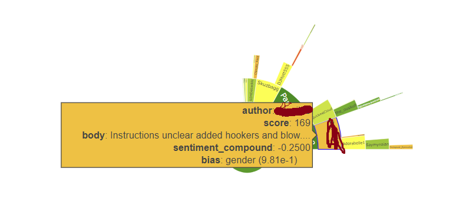

# Chrome Reddit Sentiment & Bias Analyzer

Analyze Reddit threads directly in your browser.  
The Chrome extension renders **sentiment** and **bias** legends in the popup; an expanded window shows richer charts.  
All heavy lifting runs on a **Flask backend (Cloud Run)** — *no setup or API keys required for end users*.

## Screenshots


*Left: Quick sentiment and bias analysis directly in your browser popup | Right: Detailed visualizations with interactive bar charts and sunburst diagrams*




*Interactive features: Hover over comments to see detailed sentiment scores and bias analysis (left) | Explore comment hierarchy with sunburst visualization (right)*


---

## Features
- **Sentiment (VADER/NLTK)** on up to **2000** comments per thread  
- **Bias (HateBERT-based, multi-label)** on up to **60** top comments  
- **Fast UX**: sentiment first, bias added separately  
- **Privacy-friendly**: Reddit API keys + model files are server-side on GCP

---

## How It Works (Flow)
1. User opens a Reddit thread and clicks the extension.  
2. **Frontend** sends the thread URL to the backend.  
3. **Backend** (Cloud Run):
   - Scrapes via `asyncpraw` (server-side keys)
   - Runs VADER on up to 2000 comments
   - Runs HateBERT-based bias model on up to 60 comments
4. **Frontend** shows:
   - **Popup**: sentiment & bias legends (quick)
   - **Expanded window**: bar chart + sunburst + details

---

## Project Structure

```
repo/
├─ backend/
│  ├─ main.py                 # Flask app (routes, CORS, model cache)
│  ├─ reddit_analysis.py      # Reddit load + VADER + bias inference wrappers
│  ├─ model_loader.py         # GCS download + file verification
│  ├─ requirements.txt        # Flask, asyncpraw, nltk, transformers, torch, etc.
│  ├─ Dockerfile              # Cloud Run container
│  ├─ cloudbuild.yaml         # Optional: GCB pipeline
│  ├─ runtime.txt             # python-3.11-slim
│  └─ .dockerignore / .gitignore / LICENSE
│
└─ frontend/
   ├─ popup.html              # UI layout (legends + advanced visuals section)
   ├─ manifest.json           # Chrome MV3
   ├─ plotly.min.js
   ├─ popup.js                # app bootstrap (ES module)
   ├─ modules/
   │  ├─ ui-manager.js
   │  ├─ data-service.js
   │  ├─ chart-renderer.js
   │  └─ chart-utils.js
   └─ content.js              # page URL capture if needed
```

## Installation (Extension)

1. Go to `chrome://extensions/` → enable Developer mode
2. Load unpacked → select the `frontend/` folder
3. Open a Reddit thread → click the extension icon

## UI Behavior

- **Popup**: shows Sentiment Scale and Bias Scale side‑by‑side
- **"Open in Larger Window"**: launches a popup window with advanced visuals (bar chart + sunburst)

## Backend (Cloud Run)

End users don't need to run anything — the extension calls the hosted API.
For local dev:

```bash
# From backend/
python -m venv .venv && source .venv/bin/activate   # Windows: .venv\Scripts\activate
pip install -r requirements.txt
python main.py   # http://127.0.0.1:8080
```

## Environment (dev only)

Server‑side in Cloud Run, you already set:

- `REDDIT_CLIENT_ID`, `REDDIT_CLIENT_SECRET`, `REDDIT_USER_AGENT`
- (Model hosting) GCS credentials in the service account

## API (used by the extension)

### POST /receive_url_fast

Sentiment only (fast).

- Cap: 2000 comments (default in load_and_prepare_reddit_df)
- Body: `{"url":"https://www.reddit.com/r/.../comments/..."}`
- Returns: list of comments with sentiment + sentiment_label and metadata

### POST /add_bias_analysis

Bias only, on provided comments.

- Cap: first 60 comments (slice in main.py)
- Body: `{"comments": [ /* records from /receive_url_fast */ ] }`
- Returns: same records with a bias object per row (multi‑label scores)

### POST /receive_url

Combined (sentiment then bias) — kept for backward compatibility.

### Health/Dev

- `GET /` → health check
- `GET /test-model-download` → lists model files after GCS sync
- `GET /test-bias?text=...` → runs a single HateBERT pass and returns logits/probs

## Modeling Details

**Sentiment**: NLTK VADER (sia.polarity_scores()['compound']), thresholds ±0.05 ⇒ positive | neutral | negative.

**Bias**: HateBERT‑based classifier via Hugging Face transformers + torch.

- Loaded once per instance (cached) via model_loader.download_model_from_gcs(...)
- Required files (checked):
  `config.json`, `model.safetensors`, `special_tokens_map.json`, `tokenizer.json`, `tokenizer_config.json`, `vocab.txt`
- Inference (reddit_analysis.py): BertForSequenceClassification + softmax → {ID2LABEL[i]: prob} with labels:
  `["None","body","culture","disabled","gender","race","social","victim"]`

## CORS & Security

- CORS allows `chrome-extension://*` and Reddit domains (see main.py).
- No user tokens are handled; only public thread content is fetched server‑side.
- Reddit keys and GCS access stay hidden in Cloud Run.

## Performance Notes

- **Two‑step load**: `/receive_url_fast` (sentiment) returns quickly; `/add_bias_analysis` augments with bias later.
- **Model cache**: bias model is downloaded from GCS once per instance and reused.
- **Comment caps**: Sentiment=2000, Bias=60 (adjust in code if needed).

## Troubleshooting

- **Popup shows only part of a legend** → check container sizing in popup.html (#legend-wrapper, legend divs) and y‑axis ranges in your legend layout helpers.
- **Bias dots look compressed** → verify your log‑scale transform and normalization match the heatmap's y domain.
- **CORS errors** → confirm Cloud Run URL is reachable and chrome-extension://* origin is allowed.

## License

MIT (see LICENSE)


## AI Disclaimer
*AI assistance was used for README formatting and file review. All contents were reviewed and edited by Jackson Montuoro.*